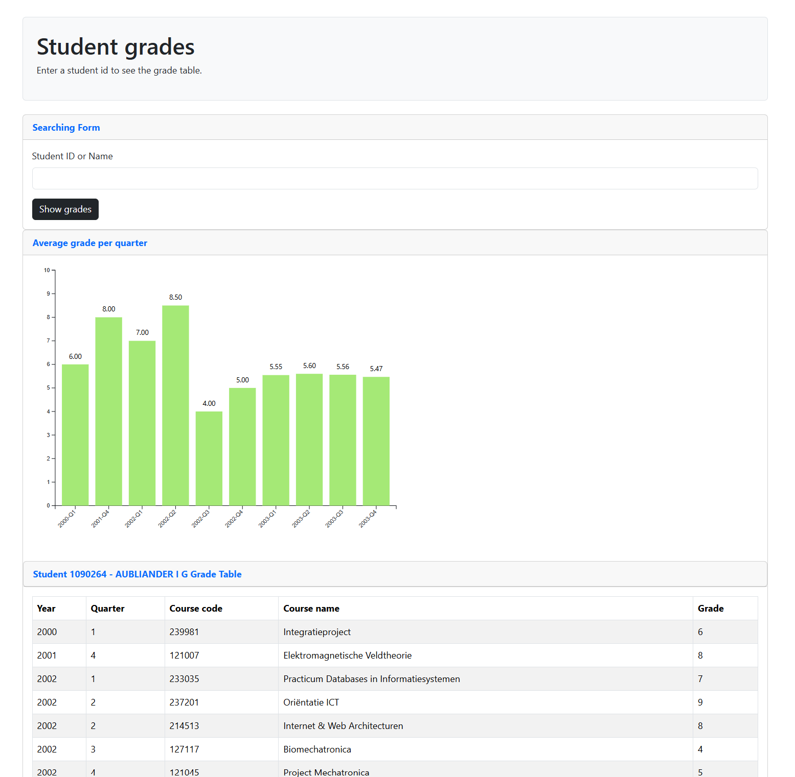

# DDA Assignment 3 Web Application

This project was developed for the course **Data-Driven Application (DDA)** at the University of Twente.
It's part of **Assignment 3: Web application development**, wehre the goal is to build a Node.js web application that connects to a PostgreSQL database and visualizes student grade data.

## Technologies Used

- Node.js
- Express
- EJS
- PostgreSQL
- pg-promise
- Bootstrap
- D3.js

## Database Connection

The application connects to the PostgreSQL server provided for the DDA Assignments.

- Host: bronto.ewi.utwente.nl
- Port: 5432
- Database: dab_dda2526-2b_34
- Schema used: srs

## Functionality

This web application allows the user to search by **student ID or student name** and retrieve grade information from the database.

The application can display:

- A table with all grades of the selected student
- A D3 bar chart showing the average grade per quarter
- Labels above the bar showing the calculated average grade value
- Use collapsible/toggle cards for the search form, chart, and grade table

## Screenshot

Screenshot of the resulting page in the browser.

